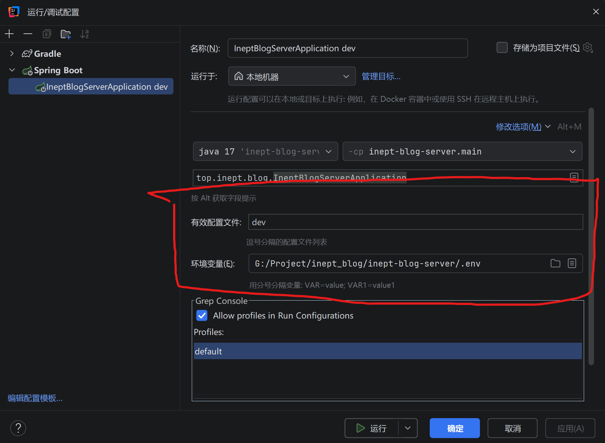

## inept-blog-server 无能博客后端

## 开发

### 1.配置需要的环境变量

> 我们在项目的根目录下创建一个`.env`文件
>
> 你可以在idea配置`.env`文件形式的环境变量，当然你可以使用其他办法载入环境变量
>```
>DB_URL=jdbc:postgresql://localhost:5432/inept_blog
>DB_USER=postgres
>DB_PASS=postgres
>JWT_ACCESS_SECRET_KEY=test-access-secret-key-that-is-long-enough-1234567890
>JWT_REFRESH_SECRET_KEY=test-refresh-secret-key-that-is-long-enough-1234567890
>MINIO_ENDPOINT=http://localhost:9000
>MINIO_ACCESS_KEY=test
>MINIO_SECRET_KEY=test
>MINIO_BUCKET=inept-blog
>```

> [!WARNING]
> - `JWT_ACCESS_SECRET_KEY`和`JWT_REFRESH_SECRET_KEY`使用`openssl rand -base64 32`生成

### 2.idea的配置

