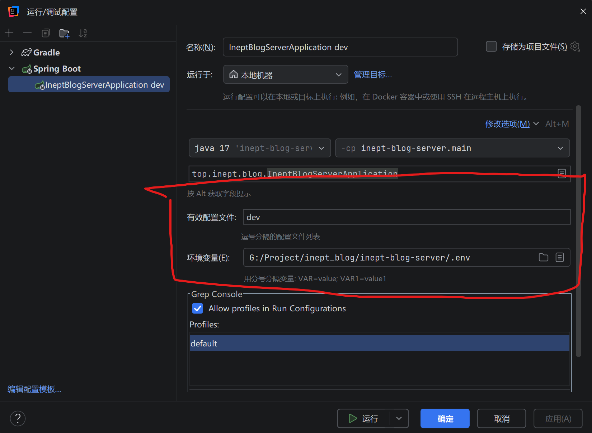

## inept-blog-server 无能博客后端

## 项目亮点

- ⭐ `kotlin` 语言
- ⭐ `rbac` 权限模型
- ⭐ 接口支持 `i18n` 多语言
- ⭐ 接口 `restful api` 规范
- ⭐ 自动生成 `openapi 3.1` 文档
- ⭐ `docker` 运行
- `springboot` 框架
- `spring security` 支持
- `spring data jpa` 支持
- `postgres` 数据库
- `github ci`构建

## 环境变量

| 变量名                          | 作用                     | 默认值 | 示例值                                           |
|------------------------------|------------------------|-----|-----------------------------------------------|
| `SPRING_DATASOURCE_URL`      | 数据库连接url               | 无   | `jdbc:postgresql://localhost:5432/inept_blog` |
| `SPRING_DATASOURCE_USERNAME` | 数据库用户名                 | 无   | `postgres`                                    |
| `SPRING_DATASOURCE_PASSWORD` | 数据库密码                  | 无   | `this_is_datasource_password`                 |
| `JWT_ACCESS_SECRET_KEY`      | JWT Access Token 签名密钥  | 无   | 使用`openssl rand -base64 64`生成                 |
| `JWT_REFRESH_SECRET_KEY`     | JWT Refresh Token 签名密钥 | 无   | 使用`openssl rand -base64 64`生成                 |
| `MINIO_ENDPOINT`             | MinIO 服务地址             | 无   | `https://s3.inept.top/`                       |
| `MINIO_ACCESS_KEY`           | MinIO 用户名              | 无   | 使用`openssl rand -hex 16`生成                    |
| `MINIO_SECRET_KEY`           | MinIO 密码               | 无   | 使用`openssl rand -base64 32`生成                 |

## 开发

### 构建Docker镜像

```shell
cd inept-blog-server

mkdir -p secrets

openssl rand -base64 32 > secrets/postgres_password.txt
openssl rand -hex 16 > secrets/minio_root_user.txt
openssl rand -base64 32 > secrets/minio_root_password.txt
openssl rand -base64 64 > secrets/spring_jwt_access_secret_key.txt
openssl rand -base64 64 > secrets/spring_jwt_refresh_secret_key.txt

docker compose up -d
```

### 搭建开发环境

#### 1.创建`.env`文件

我们在项目的根目录下创建一个`.env`文件
你可以在idea配置`.env`文件形式的环境变量，当然你可以使用其他办法载入环境变量

```dotenv
SPRING_DATASOURCE_URL=jdbc:postgresql://localhost:5432/inept_blog
SPRING_DATASOURCE_USERNAME=postgres
SPRING_DATASOURCE_PASSWORD=this_is_datasource_password

JWT_ACCESS_SECRET_KEY=test-access-secret-key-that-is-long-enough-1234567890
JWT_REFRESH_SECRET_KEY=test-refresh-secret-key-that-is-long-enough-1234567890

MINIO_ENDPOINT=http://localhost:9000/
MINIO_ACCESS_KEY=minioadmin
MINIO_SECRET_KEY=minioadmin
```

> [!WARNING]
> - `JWT_ACCESS_SECRET_KEY`和`JWT_REFRESH_SECRET_KEY`使用`openssl rand -base64 32`生成

#### 2.idea的配置



## 非商业用途声明

本项目源码公开，仅供学习、研究和个人非商业用途使用。

未经作者事先书面许可，禁止将本项目或其修改版本用于商业目的，包括但不限于：

- 出售本项目或其衍生版本；
- 将本项目作为付费服务提供；
- 将本项目集成到商业产品中；
- 用于商业公司的生产环境或商业运营。

如需商业授权，请联系作者 <ineptchanowo@gmail.com>。